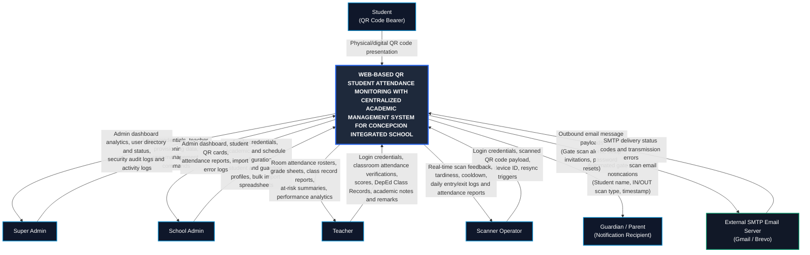

```mermaid
flowchart TB
    %% STYLING DEFINITIONS
    classDef centralSystem fill:#1e293b,stroke:#2563eb,stroke-width:3px,color:#ffffff,font-weight:bold;
    classDef externalActor fill:#0f172a,stroke:#0284c7,stroke-width:2px,color:#ffffff;
    classDef externalSystem fill:#111827,stroke:#059669,stroke-width:2px,color:#ffffff;

    %% CENTRAL SYSTEM NODE (EXACT MANDATORY TITLE)
    SYS["WEB-BASED QR STUDENT ATTENDANCE MONITORING WITH CENTRALIZED ACADEMIC MANAGEMENT SYSTEM FOR CONCEPCION INTEGRATED SCHOOL"]:::centralSystem

    %% EXTERNAL HUMAN ACTORS
    SA["Super Admin"]:::externalActor
    ADM["School Admin"]:::externalActor
    TCH["Teacher"]:::externalActor
    OP["Scanner Operator"]:::externalActor
    STU["Student<br/>(QR Code Bearer)"]:::externalActor
    PAR["Guardian / Parent<br/>(Notification Recipient)"]:::externalActor

    %% EXTERNAL TECHNICAL SYSTEM
    SMTP["External SMTP Email Server<br/>(Gmail / Brevo)"]:::externalSystem

    %% DATA FLOWS: SUPER ADMIN
    SA -->|Login credentials, teacher provisioning data,<br/>user management commands| SYS
    SYS -->|Admin dashboard analytics, user directory and status,<br/>security audit logs and activity logs| SA

    %% DATA FLOWS: SCHOOL ADMIN
    ADM -->|Login credentials, academic and schedule configuration,<br/>student and guardian profiles, bulk import spreadsheets| SYS
    SYS -->|Admin dashboard, student QR cards,<br/>attendance reports, import error logs| ADM

    %% DATA FLOWS: TEACHER
    TCH -->|Login credentials, classroom attendance verifications,<br/>scores, DepEd Class Records, academic notes and remarks| SYS
    SYS -->|Room attendance rosters, grade sheets, class record reports,<br/>at-risk summaries, performance analytics| TCH

    %% DATA FLOWS: SCANNER OPERATOR
    OP -->|Login credentials, scanned QR code payload,<br/>station device ID, resync triggers| SYS
    SYS -->|Real-time scan feedback, tardiness, cooldown,<br/>daily entry/exit logs and attendance reports| OP

    %% DATA FLOWS: STUDENT
    STU -->|Physical/digital QR code presentation| SYS

    %% DATA FLOWS: GUARDIAN / PARENT
    SYS -->|"Automated gate scan email notifications<br/>(Student name, IN/OUT scan type, timestamp)"| PAR

    %% DATA FLOWS: EXTERNAL SMTP EMAIL SERVER
    SYS -->|"Outbound email message payloads<br/>(Gate scan alerts, setup invitations, password resets)"| SMTP
    SMTP -->|SMTP delivery status codes and transmission errors| SYS
```
