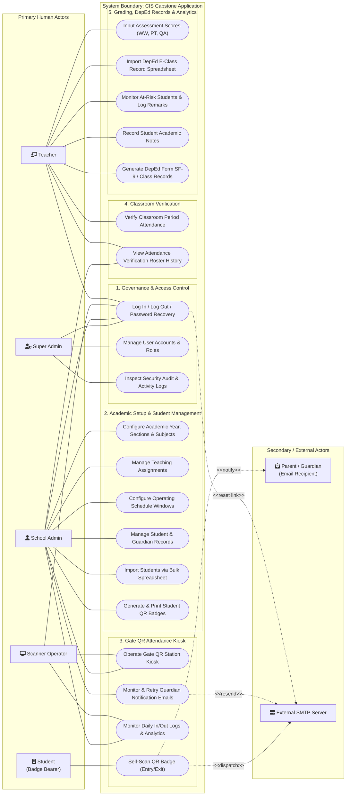
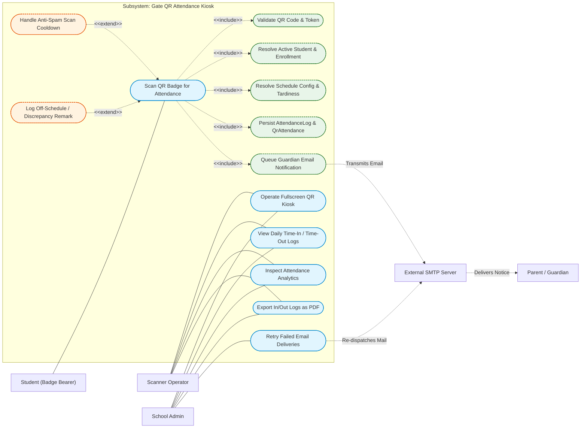
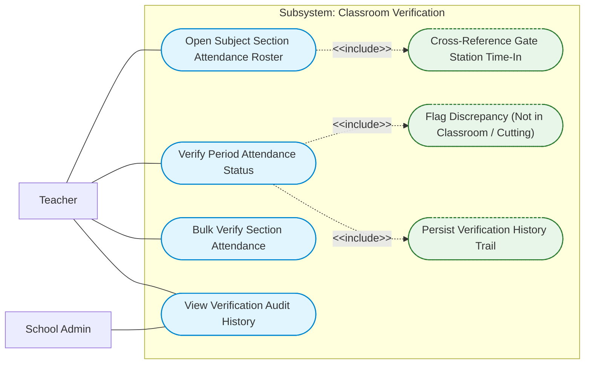
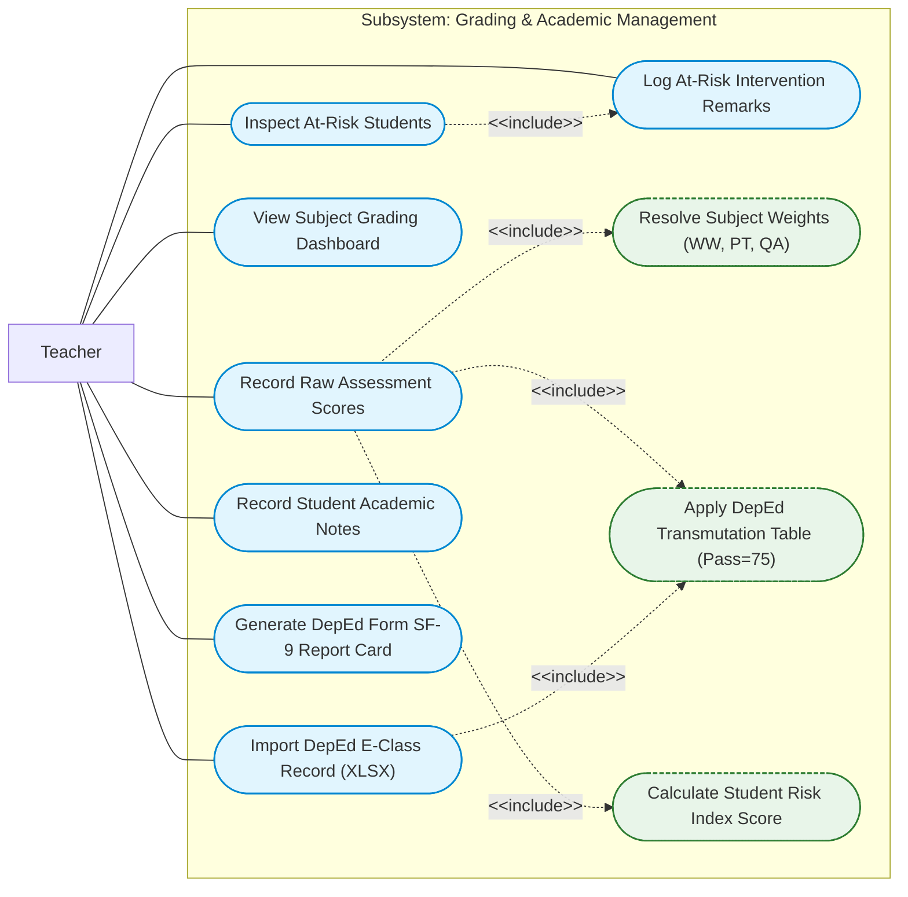
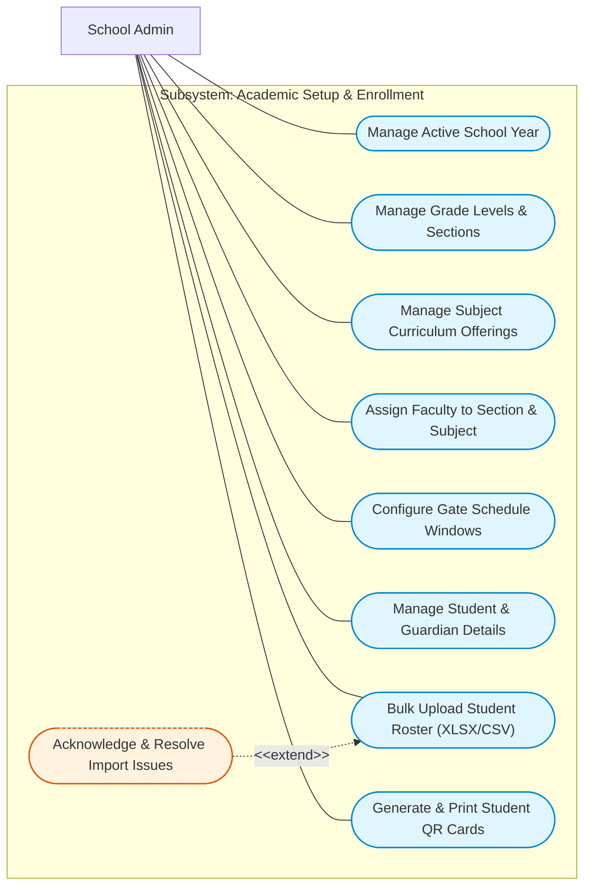
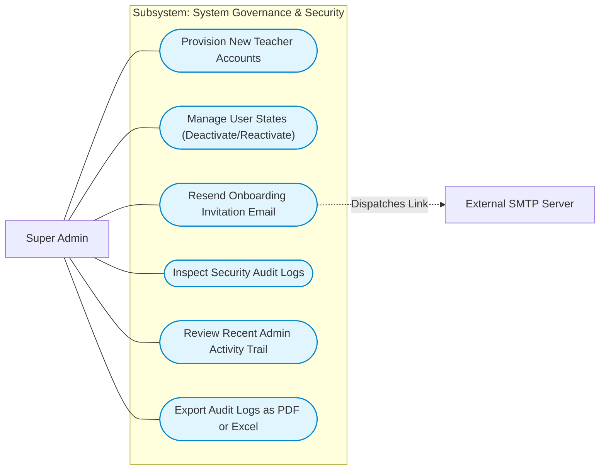

# System Use Case Diagram Documentation

> **Document Type:** Capstone / Thesis Manuscript Systems Documentation  
> **System Title:** Web-Based QR Student Attendance Monitoring with Centralized Academic Management System for Concepcion Integrated School  
> **Repository Authority:** Grounded strictly in implemented routes, controllers, middleware, and database models of the `CIS_CAPSTONE` codebase.  
> **Diagram Specification:** UML 2.0 Use Case Model (System Boundary, Primary & Secondary Actors, Use Cases, `<<include>>`, and `<<extend>>` relationships).

---

## 1. Actor Identification & System Boundary Justification

Based on the validated codebase audit (`EnsureUserHasRole.php`, `routes/`, and `documentation/05_point_of_views/`), actors are strictly categorized according to actual code capabilities:

### 1.1 Primary Human Actors (Direct Initiators)

| Actor | Access Medium | Authentication / Role Constant | Description & Scope of Authority |
|---|---|---|---|
| **Super Admin** | Web Browser | `role:super_admin` (`User::ROLE_SUPER_ADMIN`) | Apex governance authority. Sole role permitted to provision and manage user accounts (teachers, admins), inspect immutable security audit logs, and track administrative activity. |
| **School Admin** | Web Browser | `role:admin` (`User::ROLE_ADMIN`) | Operational management. Configures academic structures (school years, sections, subjects, teaching assignments, schedule configs), manages student enrollments, runs bulk Excel imports, generates student QR badge cards, monitors gate attendance, and manages email delivery logs. |
| **Teacher** | Web Browser | `role:teacher` (`User::ROLE_TEACHER`) | Instructional authority. Performs classroom period-level attendance verification, enters trimester assessment marks (Written Works, Performance Tasks, Quarterly Assessment), imports DepEd E-Class Record spreadsheets, monitors at-risk students, records academic notes, and generates DepEd SF-9 report cards. |
| **Scanner Operator** | Kiosk Hardware / Browser | `role:scanner_operator` (`User::ROLE_SCANNER_OPERATOR`) | Terminal facilitator. Account dedicated solely to authenticating the campus gate kiosk hardware, keeping the fullscreen QR scanner active, and reviewing daily time-in/time-out entry logs and analytics. |
| **Student** | Physical QR Badge | None (Physical Badge Bearer) | Physical gate participant. Presents issued physical QR badge to the autonomous kiosk optical reader to record campus entry and exit. **Has no web portal, login account, or direct database access.** |

### 1.2 Secondary / Supporting Actors (External Systems & Stakeholders)

| Actor | Role / Integration Type | Code Evidence | Interaction |
|---|---|---|---|
| **Parent / Guardian** | External Stakeholder / Notification Recipient | `guardians.email`, `AttendanceNotificationMail` | Passive recipient. Receives automated transactional email notifications upon student gate scan (arrival/dismissal timestamp, status). **Has no web portal or login account.** |
| **External SMTP Mail Server** | External Technical Infrastructure | `config/mail.php`, `App\Services\EmailLogService` | Technical subsystem. Dispatches transactional attendance alert emails to guardians and password recovery emails to staff, returning delivery confirmation or failure status. |

---

## 2. Master System Use Case Diagram

The following diagram defines the high-level system boundary, depicting how all five primary actors and two secondary actors interact with the core functional modules of the application.

---

## 3. Subsystem Detailed Use Case Models

### 3.1 Gate QR Attendance Subsystem (With `<<include>>` and `<<extend>>`)

The QR Attendance scanning workflow represents a multi-step verification pipeline triggered when a student presents their physical QR badge.

---

### 3.2 Classroom Period Attendance Verification Subsystem

Classroom attendance gives the assigned subject teacher legal verification authority over student presence during class hours, cross-referencing campus gate scans.

---

### 3.3 Academic Grading & DepEd Compliance Subsystem

Teachers record scores, compute DepEd transmuted grades, evaluate early-warning risk scores, and generate official forms.

---

### 3.4 Academic Setup & Student Enrollment Subsystem

School Administrators construct the foundational data required by all downstream subsystems.

---

### 3.5 System Governance & Security Subsystem

The Super Admin exercises exclusive control over institutional credentials and audit traceability.

---

## 4. Comprehensive Use Case Traceability Matrix

Every use case is grounded in specific Laravel routes, controllers, middleware, and database models:

| Subsystem | Use Case Title | Primary Actor | Trigger / Route | Controller / Service Grounding | Target Models / Stores |
|---|---|---|---|---|---|
| **Auth** | User Login | All Staff Roles | `POST /login` | `AuthController@login` | `users`, `login_logs` |
| **Auth** | Password Recovery | All Staff Roles | `POST /forgot-password` | `ForgotPasswordController@sendResetLinkEmail` | `password_reset_tokens` |
| **Gov** | Provision Teacher Account | Super Admin | `POST /teachers` | `TeacherProvisioningController@store` | `users`, `teachers` |
| **Gov** | Manage User Accounts | Super Admin | `GET /users`, `POST /api/users/*` | `UserManagementController` | `users`, `admin_activity_logs` |
| **Gov** | Inspect Security Audit Logs | Super Admin | `GET /security-audit-log` | `SecurityAuditLogController@index` | `login_logs` |
| **Gov** | Export Audit Reports (PDF/Excel) | Super Admin | `GET /security-audit-log/download[-pdf]` | `SecurityAuditLogController@download*` | `login_logs` |
| **Setup** | Configure School Year | School Admin | `POST /school-years` | `SchoolYearController@store` | `school_years` |
| **Setup** | Manage Sections & Advisors | School Admin | `POST /sections`, `PUT /sections/{id}/advisor`| `SectionController` | `sections`, `teachers` |
| **Setup** | Manage Subject Catalog | School Admin | `POST /subjects` | `SubjectController@store` | `subjects` |
| **Setup** | Configure Teaching Assignments | School Admin | `POST /teaching-assignments` | `TeachingAssignmentController@store` | `teaching_assignments` |
| **Setup** | Configure Scan Schedule Windows | School Admin | `POST /schedule-configuration` | `ScheduleConfigController@store` | `schedule_configs` |
| **Setup** | Manage Student Profiles | School Admin | `POST /students`, `PUT /students/{id}` | `StudentManagementController` | `students`, `guardians` |
| **Setup** | Bulk Upload Student Roster | School Admin | `POST /import/upload` | `BulkImportController@upload`, `BulkImportService` | `bulk_imports`, `students`, `enrollments` |
| **Setup** | Resolve Bulk Import Issues | School Admin | `GET /import/{id}/issues` | `BulkImportController@issues` | `bulk_import_issues` |
| **Setup** | Generate & Download QR Cards | School Admin | `GET /students/{id}/qr/download` | `QrCodeController@download` | `qr_codes` |
| **Gate** | Operate Kiosk QR Station | Scanner Operator, Admin | `GET /qr-station` | `QrStationController@index` | `qr_codes`, `schedule_configs` |
| **Gate** | Process Self-Scan QR Check-In/Out| Student (Badge) | `POST /qr-station/scan` | `ScanController@scan`, `QrScanService` | `attendance_logs`, `qr_attendances`, `scan_remarks` |
| **Gate** | Inspect In/Out Logs & Analytics | Scanner Operator, Admin | `GET /time-in-time-out-history` | `AttendanceLogController@index` | `attendance_logs`, `qr_attendances` |
| **Gate** | Monitor & Retry Guardian Emails | School Admin | `GET /emails`, `POST /emails/{id}/retry` | `EmailLogController` | `email_logs` |
| **Room** | Open Period Attendance Roster | Teacher | `GET /teacher/room-attendance/{section}` | `TeacherRoomAttendanceController@show` | `teaching_assignments`, `enrollments` |
| **Room** | Verify Student Period Presence | Teacher | `POST /teacher/room-attendance/{sec}/{enr}/verify` | `TeacherRoomAttendanceController@verify` | `attendance_verifications`, `attendance_verification_histories` |
| **Room** | Bulk Verify Section Attendance | Teacher | `POST /teacher/room-attendance/{sec}/bulk-verify` | `TeacherRoomAttendanceController@bulkVerify` | `attendance_verifications` |
| **Grade** | Input Raw Assessment Scores | Teacher | `POST /teacher/grading-system/grade-sheet/score` | `GradeSheetController@storeScore`, `GradingService` | `student_assessment_scores`, `term_grades` |
| **Grade** | Import DepEd E-Class Record | Teacher | `POST /teacher/grading-system/import-data/process`| `DepEdClassRecordImportController@process` | `assessments`, `student_assessment_scores` |
| **Grade** | Monitor At-Risk Students | Teacher | `GET /teacher/grading-system/at-risk` | `AtRiskController@index`, `RiskScoreService` | `student_assessment_scores`, `attendance_verifications` |
| **Grade** | Log At-Risk Remarks | Teacher | `POST /teacher/grading-system/at-risk/{enr}/remarks`| `AtRiskController@storeRemark` | `at_risk_remarks` |
| **Grade** | Record Student Academic Notes | Teacher | `POST /teacher/grading-system/student-profile/{enr}/notes`| `StudentProfileSearchController@storeAcademicNote`| `academic_notes` |
| **Grade** | Generate DepEd SF-9 Report Card | Teacher | `GET /teacher/grading-system/reports/student-academic-record`| `ReportsController@studentAcademicRecord` | `term_grades`, `students`, `subjects` |

---

## 5. Architectural Defense Notes (For Capstone Panel Presentation)

During an academic thesis or capstone defense, the following technical defenses must be articulated:

1. **Why is the Student not modeled as a web user?**
   - The repository explicitly omits any student login controller or authentication guard.
   - The student interacts with the system solely as a physical QR token bearer at the autonomous optical scan kiosk terminal.
2. **Why is the Parent/Guardian modeled as a Secondary Actor?**
   - Parents do not log in or manage credentials. They act strictly as external consumers receiving automated transactional notification emails dispatched via the external SMTP relay upon gate check-in/out.
3. **What makes the Scanner Operator distinct from a Guard?**
   - In code, `ScannerOperator` is a standard web account restricted to `/qr-station` and `/time-in-time-out-history`.
   - Its primary function is to initialize and monitor the autonomous self-service station terminal without exposing curriculum or student grading data.
4. **Why are Super Admin and School Admin separate actors?**
   - Separation of administrative duties: In `routes/super-admin.php`, only `super_admin` can hit `POST /teachers` or access `SecurityAuditLogController`. School administrators are restricted to curriculum orchestration and student enrollment.
5. **How is DepEd Compliance verified without an online API?**
   - DepEd integration is implemented via local parsing of standard official Excel spreadsheets (`DepEdClassRecordImportController` and PhpSpreadsheet) adhering to DepEd Order No. 8, s. 2015/2016 for weight calculations (Written Works, Performance Tasks, Quarterly Assessment) and grade transmutations. No external DepEd Web API is invoked.
